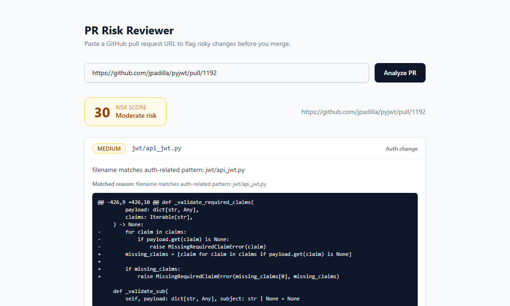

# PR Risk Reviewer

Flags risky pull requests before they merge - auth changes, DB migrations,
config/secret changes, missing tests - using deterministic, unit-tested
rules plus a scoped LLM explanation pass. Not a generic AI summarizer:
every flag traces back to a specific, testable rule, and the LLM only
explains a flag it didn't invent, grounded in the exact diff excerpt that
triggered it.



## Try it

Paste any of these into the app to see it work against real, live pull
requests:

- `https://github.com/jpadilla/pyjwt/pull/1192` - a real PyJWT change
  touching JWT claim validation; flags three files as `auth_change`
- `https://github.com/octocat/Hello-World/pull/11023` - a trivial README
  add with nothing risky in it; zero flags, risk score 0
- `https://github.com/octocat/Hello-World/pull/999999` - doesn't exist;
  shows the clean 404 error path instead of a crash

## Architecture

```
                 GET /analyze-pr?url=...
                          |
                          v
  frontend/  --->  backend/app/routers/analyze_pr.py
  (React +               |
   Tailwind)              v
                 backend/app/services/github_fetcher.py  --> GitHub REST API
                          |
                          v
                 backend/app/services/heuristics.py   (deterministic rules)
                          |
                          v
                 backend/app/services/llm_explainer.py (Gemini, per-flag)
                          |
                          v
                 { pr_url, overall_risk_score, flags: [...] }
```

- **`backend/app/services/github_fetcher.py`** - resolves a PR URL to
  `owner/repo/number`, calls the GitHub REST API, paginates changed files
  (capped so an unusually large diff can't hang the request), and maps
  GitHub error responses to clear HTTP statuses (400 malformed URL, 404
  not found/private, 401 bad token, 429 rate limited, 502 network error).
- **`backend/app/services/heuristics.py`** - five deterministic,
  unit-tested rules over the diff: `auth_change`, `migration`,
  `config_change`, `hardcoded_secret`, `missing_test`.
- **`backend/app/services/llm_explainer.py`** - for each flag, calls
  Gemini with a prompt scoped to just that flag's tag/reason/hunk, asking
  for a severity (`low`/`medium`/`high`) and a one-to-two sentence
  explanation. Flags are explained concurrently rather than one at a time.
  Falls back to a deterministic explanation (the rule's own
  `matched_reason`, severity `medium`) if no API key is set, the quota is
  exhausted, or the call fails - so the endpoint degrades gracefully
  rather than erroring out.
- **`backend/app/routers/analyze_pr.py`** - combines the three above into
  the `/analyze-pr` response and computes `overall_risk_score` as a
  weighted sum by severity (high=25, medium=10, low=3, capped at 100).
- **`frontend/`** - React + Tailwind single page: URL input, loading/
  empty/error states, and a results view with a color-coded risk badge
  and severity-sorted, expandable flag cards.

Exact request/response shapes are documented in
[`docs/interfaces.md`](docs/interfaces.md).

## Running it locally

### Backend

```bash
cd backend
pip install -r requirements.txt
cp .env.example .env   # fill in GEMINI_API_KEY; GITHUB_TOKEN is optional
python -m uvicorn app.main:app --reload --port 8000
```

Without `GEMINI_API_KEY` set, flags still get a severity and explanation -
just the deterministic fallback instead of an LLM-generated one - so the
API stays usable without the key. A free-tier Gemini key has a small
request quota, especially on newer preview models; hitting it falls back
the same way rather than erroring.

Without `GITHUB_TOKEN`, only public repos work, at GitHub's unauthenticated
rate limit (60 requests/hour). Set `GITHUB_TOKEN` (or send an
`X-GitHub-Token` header per request) for private repos or a higher limit.

### Frontend

```bash
cd frontend
npm install
cp .env.example .env   # VITE_API_BASE_URL, defaults to http://127.0.0.1:8000
npm run dev
```

Note: the frontend defaults to `127.0.0.1` rather than `localhost` for the
API base URL - on some systems `localhost` resolves to the IPv6 loopback
address first in the browser, while `uvicorn` without `--host` binds only
the IPv4 address, which silently breaks every request.

### Tests

```bash
cd backend
python -m pytest tests/
```

The suite includes real integration tests that call the live GitHub API
against small public PRs (no token needed), alongside fast unit tests with
mocked/synthetic data.

## Team

Built by three contributors, each in their own scope: the GitHub PR
fetcher and hardening, the heuristics engine / LLM explainer / aggregation
endpoint, and the full frontend plus SkillPatch integration - then
combined in an integration pass that swapped the mock fetcher for the
real one and verified the whole pipeline end-to-end against live PRs.

## SkillPatch

Installed the [`code-review`](https://skillpatch.dev/skills/code-review-4)
skill (slug `code-review-4`) into `skills/code-review/SKILL.md` and applied
its severity-grouped review criteria to a self-review pass over the
frontend code, which caught a real issue (no request timeout, so a hung
backend would strand the UI in the loading state). Full details, including
what its underlying CLI dependency meant in practice, are in
[`docs/skillpatch-usage.md`](docs/skillpatch-usage.md).
